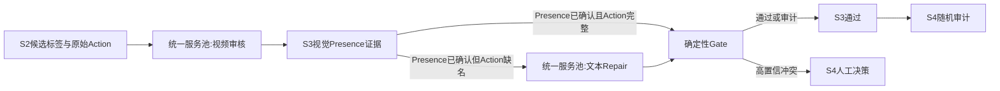

# S2/S3/S4 优化执行方案：视频证据、统一服务池与低触审核

> 状态：执行设计草案（2026-07-20）。
>
> 本文记录降低 S4 人工量、提升 gold 质量的执行方案。它不改变
> `schemas_and_contracts.md` 中 prompt-complete、冻结 gold 与 layout 的正式契约。

## 1. 现状与目标

`0001_American_Beauty` 的 300-segment S3 运行产生：

- `60` 个 `BLOCK`；
- `240` 个 `PASS`；
- S4 队列 `75` 张：全部 `60` 个 BLOCK 加 `15` 个 PASS 审计样本；
- BLOCK 的主因是 `action_missing_canonical_name`，不是切片失败。

根因是 S1/S2 action 常用“男子”“两人”“街道”等泛称，而
`present_entity_ids` 已包含多个 canonical entity。可验证的 prompt 完整性问题
因此被直接升级为逐 segment 的人工决策。

目标必须同时满足：

1. **质量**：每个保留 segment 的 action 自然包含经 S3 视频证据确认的
   present entity canonical name；低置信模型不能静默删除标签。
2. **速度**：健康 endpoint 动态领取任务，不按 H800/A800 静态划分角色。
3. **低触审核**：人工工作随真实残余不确定性增长，而非随 segment 数增长。

非目标：

- 不因 action repair 失败遗弃叙事片段；
- 不放松 prompt-complete gate，也不把 BLOCK 静默改为 PASS；
- 不改变 SUT-facing 输入、评分字段或已冻结 layout。
- 不把“human-confirmed roster”误解成“每个 segment 的 presence 已人工确认”。

## 2. 端到端流程

同一个 segment 内任务按依赖串行；不同 segment 的已就绪任务进入同一个全局队列，
由任意空闲、具备所需能力的 endpoint 执行。



统一服务池的规则：

- endpoint 完成一次请求立刻归还池；下一个任务可由任意空闲 endpoint 执行；
- 视频审核与文本 repair 对单 segment 串行，但不要求同一 endpoint；
- 视频任务仅派发给通过真实 `file://` 视频健康检查、共享媒体根和模型契约均匹配的 endpoint；
- 文本 repair 只要求通过结构化文本健康检查；
- ffmpeg 仍是独立受限资源，使用全局 `max_clip_workers`，不得随 endpoint 数增加；
- 当前可用服务均为 8B。先通过确定性规则、重试和后验校验提升质量，不预设 32B 服务。

## 3. S2：结构归一化与候选准备

S2 不建立 segment-level presence 信任。S1 的 `present_entity_ids` 和
presence-window overlap 在 S2 都只是送往 S3 的候选，不能因 roster 已人工确认就自动成为可信事实。
S2 只做 schema、ID、时间范围、重复项和可逆格式归一化；不改
`present_entity_ids`，也不基于候选 entity 往 action 添加语义。

S2 必须保留候选来源，使 S3 能区分 `seed_claimed`、时间窗重叠和模型新提议。

## 4. S3：先用视频建立 PresenceLabel，再修 action

### 4.1 基于视频的 PresenceLabel

S3 针对每个候选 entity 输出版本化 `PresenceLabel`：

```json
{
  "segment_id": "seg_0011",
  "entity_id": "char_002",
  "candidate_source": "seed_claimed",
  "visual_verdict": "present",
  "confidence": "high",
  "evidence": {"frame_refs": ["f0123.jpg"], "reviewer": "qwen3-vl-8b"},
  "trust_tier": "s3_confirmed"
}
```

初次视频核验可使用一个 8B endpoint。出现低置信、候选删除、或与原 action 明显冲突时，
将该 entity 交给第二个独立 endpoint/不同帧采样复核：

| S3 证据结果 | presence 处置 |
|---|---|
| 高置信一致 `present` | `s3_confirmed`，可用于 action repair |
| 高置信一致 `absent` | `s3_rejected`，生成 S4 的 `edit_present` 候选 |
| 两路分歧、低置信、或无有效视觉证据 | `uncertain`，进入校准分层或 S4 |

只有 `s3_confirmed` 的 entity 才进入自动 action repair 的 required name 集。
这使 trust contract 是 S3 的可审计输出，而不是 S2 的不可证明假设。

### 4.2 视频审核

8B 视频审核输出视觉事实和不确定性：

- 是否存在高置信 presence 反证；
- 是否跨越明显无关事件或违反 segment 时长边界；
- 是否存在影响动作事实性的冲突。

低/中置信结论不能覆盖候选标签，也不能把候选直接写入 gold；它们保留为
`uncertain` 的审计证据。

### 4.3 文本 repair

若视频审核后 `s3_confirmed` entity 仍未出现在 action 中，创建独立的文本 repair 任务。它只接收：

```json
{
  "segment_id": "seg_0011",
  "prior_action": "中年男子出门打招呼。",
  "trusted_present_entity_ids": ["char_001", "char_002", "loc_003"],
  "required_entities": [
    {"entity_id": "char_001", "name": "中年男子", "kind": "character"},
    {"entity_id": "char_002", "name": "中年女子", "kind": "character"},
    {"entity_id": "loc_003", "name": "郊区街道", "kind": "location"}
  ]
}
```

文本任务不重新判断视频。每个候选由确定性 gate 验证：

1. 所有 required canonical name 均逐字出现；
2. 不含 entity-list coda；
3. 不创建 roster 外实体；
4. 失败时返回缺失 name，并以不同的紧凑提示有限重试；
5. 候选、拒绝理由、重试和 endpoint 都写入 audit。

## 5. S4：只审核不可自动判定的问题

| 类别 | 默认处置 | 人工单位 |
|---|---|---|
| 高置信 presence/boundary 冲突 | 必审 | 单 segment 窄决策 |
| 首次出现、关键状态变化、身份歧义 | 必审 | 按实体/事件聚合 |
| 最终文本 repair 失败 | 必审 | 单 action 编辑 |
| 低置信视觉分歧 | audit evidence | 随机抽样 |
| PASS | 随机审计 | 支持批量接受剩余样本 |

S4 的 `accept` 不能覆盖任何确定性失败。每次人工决策后都必须重算完整 annotation 的
schema、canonical-name、presence-ID、prompt-complete 与 layout gate。

PASS 审计率必须由已标注样本估计的自动错误率校准，而不是只为降低队列而任意设定。
抽样须冻结 seed、总体、分层（高影响事件、repair 类型、endpoint/model、影片规模）和升级规则：
对每个分层以 Phase 0 控制集估计错误率，并在 `review_audit.json` 写入单侧
Wilson 上界、`max_auto_error_rate`、样本量和 policy version。上界超过
`max_auto_error_rate` 时自动提高该层抽样率或阻止 promotion；阈值不得硬编码在前端。

## 6. 调度状态与可观测性

每个 segment 有持久、幂等的任务 ledger；任务可在任意健康 endpoint 间迁移：

```json
{
  "segment_id": "seg_0011",
  "state": "pending_presence_recheck",
  "video_review": {"endpoint": "http://host:8110/v1", "confidence": "low"},
  "presence_labels": {"char_001": "s3_confirmed", "char_002": "uncertain"},
  "repair_attempts": 1,
  "required_names": ["中年男子", "郊区街道"],
  "next_task": "presence_recheck"
}
```

任务状态至少包括 `video_review`、`text_repair`、`retry`、`human_decision`、
`validation`。retryable failure 必须在有限次数内换 endpoint 自动重试；耗尽后才进入
S4 的“基础设施”卡或显式 re-queue 状态。不能把 `RETRYABLE_ERROR` 从 S4 排除后又没有后续调度路径。

每部影片汇总：

- 视频任务、文本任务、重试任务数量与等待时间；
- ffmpeg 切片重试/失败数；
- S3 presence 确认/拒绝/不确定的比例、文本 repair、人工 edit 的成功率；
- 高置信冲突、低置信 audit、S4 必审数；
- endpoint capability、耗时、错误与最终 S7 gate。

## 7. 实施顺序与验收

### Phase 0：冻结基线

- 保存当前 American Beauty 的 S3/S4 分布；
- 人工抽看 BLOCK 与 PASS，建立小型对照集，区分 canonical 缺名、
  真实 presence 冲突和误报 boundary；
- 定义并版本化 `PresenceLabel` 信任与证据契约；
- 修复 S7 preflight：验证完整 applied patch、artifact/hash、layout compatibility；
- 修复 `build_gold` 的 `representations`/`reps` 字段不一致，并增加带非空 crop 的
  S7 smoke，确认真实 freeze 路径可运行；
- 不把当前 75 张卡解释为 75 个同等级质量错误。

### Phase 1：S2 候选/provenance 与 S3 PresenceLabel

- 在 S2 保存候选来源、结构 lint 和可逆归一化；
- 在 S3 落地 `PresenceLabel`、独立复核和可引用的视频证据；
- 将 action repair 的 required entity 集限制为 `s3_confirmed` 标签。

验收：不减少任何 segment；每个进入 action repair 的 entity 均有可追溯的视频证据；
S1 候选不会因 roster 存在而自动提升为可信事实。

### Phase 2：统一池两阶段 S3

- 视频审核与文本 repair 成为可恢复的独立任务；
- 所有 endpoint 按持久 capability record 动态领取任务，完成即归还；
- 对文本 repair 施行有限重试和确定性后验；
- 真实视频健康检查通过前，不给 endpoint 派发视频任务。

验收：无固定硬件分区造成的空闲；segment 内依赖顺序可审计；高并发下切片失败为零或可恢复。

### Phase 3：S4 降载校准

- 只有高置信冲突、关键实体/状态问题、最终 repair 失败进入必审；
- PASS 做可测的随机审计，并支持批量接受；
- 与 Phase 0 对比必审数、审计错误率、prompt-complete 通过率和人工用时。

验收：人工量随残余不确定性而非 segment 数增长，且进入 S7 的 segment 仍满足冻结契约。

### 模型层级边界

“统一 8B 服务池”仅是 S2/S3/S4 的默认执行策略，不是整个标注系统的 blanket policy。
identity-critical 的 S5/S6 仍可能要求更强模型 tier。endpoint capability record 必须包含
`model_tier`，调度器按任务所需 tier 过滤，不能把 8B-only 服务误派给身份仲裁任务。

## 8. 不可突破的契约边界

1. 含 unresolved required task 或未审查的 gold 不得用于正式评测。
2. 不可因模型 repair 失败静默删除叙事片段。
3. layout 或 excluded-segment 改动意味着新数据版本，必须重算 layout hash。
4. 模型输出始终是可替换 proposal；ID、完整性和最终分数由确定性契约控制。
5. S4 的任何 `accept` 都不能跳过或覆盖完整 annotation 的确定性复验。
6. 8B 统一池不自动取代 identity-critical 阶段所需的更强 model tier。
